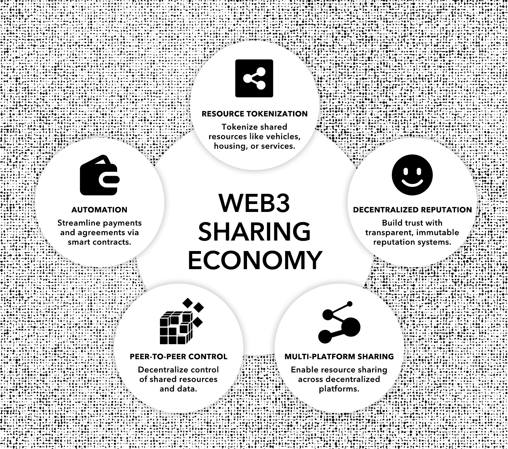

# Uptick Ecosystem Development Whitepaper

**1. Abstract**

This Ecosystem Development White Paper is the third installment in Uptick’s white paper series, following the Technical White Paper and the Economic Model White Paper. Our goal with this series is to systematically outline Uptick’s mission, philosophy, technology, models, and development across various dimensions. Unlike the previous two white papers, this Ecosystem Development White Paper covers a broader range of topics and will be a continuously evolving document.

In this first version, we focus on introducing Uptick’s ecosystem development concepts and methodology, which are summarized from a large number of articles published over the past three years. Sustainable ecosystem development begins with establishing a solid methodology. Drawing from the team’s 20+ years of experience in the internet and real economy sectors, we have identified six representative Web3 economic models. We then explain how Uptick’s technical infrastructure modules can be used to build these economic models, laying the foundation for a robust Uptick real economy protocol layer. Finally, we describe how to further package these protocol models and Web3 business logic to form Uptick’s cloud services, which directly serve Web2 businesses and users.

This document will be a “Live Document,” continuously updated as the Uptick protocol layer and service layer grow, and as various ecosystem applications are developed and implemented by the community. We also welcome thought leaders in the industry to join us in this endeavor—through both theoretical discussions and practical implementation—working together to build an ecosystem that serves the real economy and realizes the vision of large-scale Web3 adoption.

**2. Introduction**

This whitepaper presents an in-depth exploration of Uptick Network’s strategic approach to integrating Web3 into the real economy. With traditional frameworks increasingly plagued by inefficiency, a lack of transparency, and monopolistic control, there is a genuine need for fresh, sustainable innovations. Uptick Network addresses these challenges by delivering the Web3 infrastructure to support relevant applications that serve everyday needs, driving meaningful and sustainable change.

Much like the internet revolutionized communication and commerce, and cloud computing transformed how businesses store and manage data, Web3 represents the next step in the evolution of the digital world. While previous transformations optimized centralized systems, Web3 fundamentally changes the balance of power by decentralizing control and shifting value back to users and communities. Just as cloud computing simplified infrastructure management, Web3 enables businesses to operate within trustless environments, allowing digital ecosystems to become inherently more secure, transparent, and autonomous.

Building upon this technological evolution, Uptick's Web3 infrastructure is designed to enable new forms of value creation, governance, and community participation, addressing real-world needs such as decentralized commerce, sovereign digital asset ownership, and peer-to-peer networks. However, realizing this vision requires a fundamental rethinking of economic models, individual autonomy, and collaborative frameworks. Our strategy is deeply rooted in a practical vision aimed at expanding ecosystem applications that align with the needs of the real economy, structured around six key Web3 economy models. These are designed to support smooth transitions for businesses and individuals into decentralized frameworks, aligning with real-world needs and forging a path to mass adoption.

As the global economy evolves, we believe Web3 integration is essential for enabling innovative business models and frameworks for decentralized ownership. Uptick Network’s mission is to provide the infrastructure and tools businesses and users need to fully engage in the Web3 economy, laying the foundation for the next generation of the internet. In this whitepaper, we thoroughly examine our philosophy behind Web3 ecosystem development, the various Web3 economy models we've established, and the foundational infrastructure that supports them.

**3. Overview**

**3.1 The Web3 Mindset**

The transition to Web3 requires a fundamental shift in how individuals and organizations approach technology, governance, and digital assets. Rather than focusing solely on technological change, Web3 represents a broader philosophical shift toward decentralization, where control is distributed across networks. This approach prioritizes transparency, autonomy, and user ownership, completely reshaping how individuals manage their data and digital interactions.

Web3 introduces a decentralized framework that distributes power, allowing users to take ownership of their data and assets. It reduces the need for central authorities and builds a trustless infrastructure where transactions and interactions are verified through open, secure protocols. Decentralized networks enable community-driven innovation that is central to the Web3 mindset. With a diverse array of participants contributing to the development of new applications, it creates an environment that promotes collaboration and forward-thinking. Younger generations, familiar with digital spaces that value autonomy, are well-aligned with this emerging model.

For businesses and developers, Web3 is about embedding decentralization, transparency, and user empowerment into the foundation of their systems. This requires building platforms that enable just outcomes and reflect the evolving digital economy. Though still in its early stages, Web3’s evolution is reminiscent of the early internet, with foundational technologies such as NFTs, RWAs, DIDs, ZKPs, and more forming the backbone of new models for commerce, social interaction, and governance. Practical applications, such as NFT-based ticketing or loyalty programs, provide a glimpse of what’s possible as the infrastructure matures. As the Web3 mindset matures, it will shape the next wave of advancements and unlock brand new possibilities in the global economy.

**3.2 Strategic Approach to Web3 Development**

Uptick Network's approach to Web3 development emphasizes a strategic and phased integration of blockchain into existing systems. The transition to Web3 is not a one-size-fits-all solution but requires careful consideration of where and how blockchain can add the most value. This involves enhancing transparency, improving security, and optimizing processes such as supply chain management and payments, while also enabling new business models that fundamentally change the relationships between involved parties.

To effectively integrate blockchain without disrupting existing systems, Uptick Network advocates for a layered, modular approach tailored to the needs of each industry:

* Choosing a Web3 platform that enables interoperability with other networks.
* Scalable middleware, protocols, and services, with a clear data migration strategy.
* Industry-specific regulatory compliance, particularly in regard to data privacy and security.
* Implementation of pilot projects to assess feasibility and gather feedback before full-scale deployment.
* Gradual expansion of blockchain adoption to limit operational risks and disruptions.

Scalability is considered from the outset to confirm that these new systems can handle growing transaction volumes and industry demands, but it is often underestimated during blockchain-powered implementation. Uptick Network addresses this from the start, designing systems that handle growing transaction volumes and maintain performance during periods of high network activity. Smart contract optimization is also prioritized to avoid issues such as high gas fees or execution failures, which can affect user experience and operational efficiency.

As Uptick Network advances its Web3 infrastructure, there is a focus on creating economy models tailored to specific sectors. These models integrate modular domain knowledge with Web3 protocols, allowing businesses to transition into Web3 with innovative yet practical solutions. This is a strategic and layered approach that sets the foundation for widespread Web3 adoption in the real economy, offering scalable, interoperable, and secure solutions for a wide range of industries.

**3.3 Web3's Influence and Potential to Transform the Real Economy**

The integration of Web3 into the global economy represents a shift in how value is created, exchanged, and governed. Moving away from traditional centralized systems, Web3 introduces a distributed and transparent framework, allowing broader participation in economic activities. This approach opens new opportunities for individual creators, small businesses, and niche platforms to compete effectively on a global scale. One of the most notable promises of Web3 is its potential to democratize value creation. Blockchain and tokenization allow previously inaccessible or illiquid assets to be digitized and traded globally. This is especially relevant for Real-world Assets (RWAs), where Web3 enables these assets to be brought into decentralized ecosystems. Tokenization of resources like lithium and uranium, for example, could transform how these strategic assets are managed and exchanged, providing new opportunities for underrepresented regions.

Cross-border transactions and cooperative settlements, which were previously constrained by traditional financial systems, now have new pathways for operation. Web3 introduces a new framework for economic development, allowing resources to flow more freely and transparently. Tokenizing and trading assets, such as real estate or natural resources, transforms traditional models of ownership and exchange. As a result, industries like finance and real estate are reimagining their structures, leading to new growth and innovation.

The integration of Web3 with the real economy will lead to fresh opportunities and transformative advancements. Tokenization and blockchain are bridging digital and physical economies, leading to more efficient, transparent systems, and this transformation reshapes global value creation and distribution, signaling a new direction for the future economy. Web3’s new economic framework decentralizes power structures, promotes transparency, and drives innovation, expanding economic participation across industries and setting the foundation for a more inclusive global economy.

**3.4 Developing a Sustainable Web3 Infrastructure and Ecosystem**

Developing a sustainable Web3 infrastructure requires aligning technological advancements with practical industry needs. This process redefines digital economies, with an emphasis on decentralization, data ownership, and community-led participation. Blockchain serves as the core of this infrastructure, providing a secure and transparent system for recording transactions without intermediaries. Smart contracts automate business processes and simplify operations, building trust within decentralized systems. Together, these components create a foundation for a decentralized ecosystem capable of supporting multiple industries.

NFTs and tokenized Real-world Assets (RWAs) extend Web3’s scope by offering new methods for engaging with both digital and physical assets. Tokenization of assets like real estate or natural resources introduces new economic opportunities, increasing liquidity and enabling broader participation in ways that were previously difficult to achieve within Web2 systems. Uptick also focuses on pan-RWA, which encompasses a wide range of tokenized real-world assets such as tickets, artworks, memberships, music, and more.

For Web3 to remain adaptable, the infrastructure must be modular and scalable. Technologies such as Cosmos-SDK illustrate how modular systems can enable interconnected blockchains to operate independently while maintaining communication across networks. This flexibility allows the infrastructure to evolve alongside changing industry requirements.

Building this infrastructure also involves addressing regulatory challenges, which vary by region. Businesses need to navigate these regulatory frameworks carefully while continuing to innovate within the Web3 space, supporting sustainable growth. A successful Web3 ecosystem is built on openness, interoperability, and asset diversity. The digital world is ever-growing, and practical applications that deliver tangible value will shape the future of businesses and individuals participating in the Web3 economy.

**4. Uptick Web3 Economy Models**

Web3 economy models provide structured frameworks that guide the development and operation of decentralized applications and platforms. These models define the principles and mechanisms by which value is created, exchanged, and governed within decentralized ecosystems. They function much like design patterns in software architecture, offering practical solutions to common challenges in Web3, driving consistency and efficiency across decentralized systems. Each Web3 economy model is tailored to address specific industry use cases, providing adaptable blueprints for various sectors of the economy. With the adoption of these models, developers and businesses can build decentralized applications that adhere to core Web3 principles such as transparency, security, and community-driven participation.

This section outlines the key Web3 economy models implemented by Uptick Network and explores how these models transform traditional economic structures. Through a detailed examination of each model, we highlight their practical applications and their role in advancing decentralized ecosystems, contributing to the broader growth of the Web3 economy.

<figure><figcaption></figcaption></figure>

**4.1 Web3 E-Commerce Economy**

**4.1.1 Historical Context and Evolution**&#x20;

The e-commerce sector has transformed over the past two decades, driven by centralized platforms that have reshaped global retail. These platforms brought convenience and accessibility, changing consumer behavior and business operations. However, centralized systems have highlighted issues around data privacy, high fees, and pressures on smaller participants.

Demand for alternatives has grown. Web3 shifts control from centralized entities to decentralized networks, enhancing transparency, security, and user autonomy. A defining characteristic of Web3 e-commerce is tokenization, turning physical products and services into on-chain tokenized assets (RWA). Once established, these assets can connect with decentralized financial systems (DeFi), enabling innovative business models through single or multi-product combinations and creating opportunities for both primary and secondary markets.

**4.1.2 Addressing Core Challenges** **Data Control and Privacy**&#x20;

Centralized platforms amass user data without transparency or consent, raising privacy concerns. Web3 decentralizes data control, returning ownership to users, enhancing privacy, and rebuilding trust. On-chain assets carry attributes like authenticity and traceability, offering verifiable transactions.

**High Fees and Market Control**&#x20;

Centralized platforms impose high transaction fees, affecting smaller sellers and favoring larger entities. Web3 reduces fees by enabling direct transactions via smart contracts. Rights certificates, such as delivery vouchers, can collect dividends from secondary markets, enhancing liquidity and trust.

**Lack of Transparency**&#x20;

Opaque operations, particularly in algorithms for search and pricing, can undermine trust in centralized platforms. Web3 introduces transparency through distributed ledgers, where transactions are publicly recorded. This builds trust, ensuring fair operations and minimizing fraudulent activities.

**4.1.3 Uptick’s Web3 Model**

Uptick Network reimagines Web3 e-commerce through an infrastructure designed to tackle the core issues facing modern digital marketplaces. Utilizing decentralized protocols, Uptick provides businesses and consumers with increased control over data, reduced transaction costs, and improved transparency. This infrastructure is designed to streamline operations, minimize reliance on intermediaries, and create a more secure, trust-based environment for digital commerce.

<figure><figcaption></figcaption></figure>

**Data Management**&#x20;

Effective data management is essential in e-commerce, where user data, transaction histories, and product information must be handled securely. Uptick Network’s infrastructure, built on the Cosmos-SDK framework with EVM extension, decentralizes data management, safeguarding sensitive information from breaches and unauthorized access. With the integration of decentralized storage solutions, e-commerce platforms gain access to a reliable, transparent, and tamper-proof system for storing transaction metadata and product details. To further enhance functionality, Uptick integrates Oracle modules that provide real-time data feeds, allowing platforms to securely access up-to-date information on pricing, inventory levels, and external market conditions.

In addition to secure data management, Uptick Network’s data service enhances the ability of e-commerce platforms to analyze and access both real-time and historical data. With the ability to offer decentralized data querying and analytics, the service enables businesses to refine customer insights, optimize inventory management, and track transaction histories with greater precision. Built on Uptick’s secure infrastructure, this system allows for tamper-proof data analysis while preserving privacy through cryptographic techniques. With seamless integration across on-chain and cross-chain ecosystems, the service provides platforms with comprehensive analytics and management capabilities.

**Smart Contracts and Transaction Autonomy**&#x20;

Automation is central to improving the efficiency of e-commerce operations. Uptick supports both EVM and WASM smart contracts, offering flexible automation for core business logic functions like payments, order fulfillment, and dispute resolution. These contracts adapt to various use cases, reducing the need for intermediaries, which lowers costs and speeds up processes. Payments can be released automatically upon delivery confirmation, and refunds can be processed without manual intervention, leading to a more efficient user experience.

Uptick Network enhances e-commerce with the integration of EVM and WASM smart contracts, providing platform interoperability and scalability. EVM contracts, trusted for their security and widespread adoption, allow businesses to manage digital assets using reliable ERC standards, essential for high-value transactions. WASM contracts, known for their efficiency, cater to resource-intensive applications that require high performance. With Uptick’s contract converter, businesses can transition between EVM and WASM environments, offering them the flexibility to optimize their operations across different Web3 scenarios.

**Decentralized Governance for Platform Management**&#x20;

Uptick’s DAO-based governance system transforms decision-making processes for e-commerce platforms, shifting control to the community. With DAO frameworks, participants, ranging from merchants to customers, can collectively determine key platform decisions such as fee adjustments, operational changes, and new feature rollouts. This participatory governance model creates a transparent and accountable environment, eliminating centralized control and allowing stakeholders to have direct input in shaping the platform.

For e-commerce, this decentralized governance offers a major advantage: it builds trust and enables deeper engagement among users. Merchants and customers no longer operate under arbitrary rules dictated by platform owners; instead, they become active contributors in decision-making. The flexibility of Uptick's DAO model means that marketplaces can quickly adapt to changing needs and market conditions, leading to an evolving platform that reflects the collective interests of its participants. Ultimately, this results in a more community-driven and user-responsive marketplace.

**Tokenization and Traceability**&#x20;

Tokenization is a key component of Uptick’s programmable Web3 infrastructure, offering a flexible approach for creating customer incentives and loyalty programs. Merchants can tokenize rewards, discounts, and benefits, transforming traditional customer engagement models. These tokenized assets can be earned through activities like purchases, reviews, or referrals and then redeemed across multiple platforms, making them more versatile and valuable than conventional rewards.

Uptick’s system goes further by anchoring goods and services to 1:1 digital certificates, providing transparency and traceability through credit guarantees from sellers or trusted institutions. This structure creates a tamper-proof environment where real-world assets (RWAs) are securely tied to digital representations, building trust between consumers and merchants. The traceability of tokenized assets also enhances accountability, allowing users to verify the authenticity and provenance of goods, which is crucial in high-value or sensitive markets like luxury goods, supply chains, or even renewable energy credits.

**Social Marketing and Token Incentives for User Development**&#x20;

To provide rapid, precise, and effective user acquisition, Uptick enables the integration of social network marketing and multidimensional token incentive models. Each user in the Web3 ecosystem can transform into both a consumer and a salesperson, driving growth and long-term engagement. Users are empowered to promote platforms through social channels, earning rewards based on their contributions to community expansion, content creation, or sales referrals. This flexible, performance-driven model aligns user interests with platform success, creating a powerful feedback loop that enhances both user retention and platform development.

In addition, Uptick’s token-based incentives can be tailored to specific user behaviors, rewarding actions such as referrals, participation in governance, or consistent engagement. These personalized rewards enable stronger connections between users and the platform, encouraging sustained involvement and reinforcing loyalty over time. The combination of social network marketing and dynamic token incentives gives platforms a comprehensive, scalable approach to growth and community building.

**Interoperability and Cross-Chain Transactions**&#x20;

Global e-commerce platforms need to conduct cross-border transactions with efficiency and security. Uptick’s Cross-Chain Bridge (UCB) and IBC (Inter-Blockchain Communication) Protocols enable the transfer of digital assets and currencies across various blockchain networks, allowing platforms to accommodate diverse payment methods and operate across multiple jurisdictions. This compatibility allows businesses to interact with global markets without being limited to geographical or blockchain-specific constraints.

For enhanced privacy and security, Uptick integrates ZK Proofs (ZKPs), keeping transaction details confidential while maintaining transaction accuracy. This approach protects sensitive information, even as transactions are processed across decentralized networks. Reducing friction in cross-border operations, these tools improve the fluidity of international sales, making it easier for businesses to expand into new markets and securely manage transactions across regions. The ability to transition between payment methods and assets helps e-commerce platforms cater to a wider customer base, promoting smoother and more secure global commerce.

**Omnichannel Payment Module**&#x20;

Providing flexible and secure payment options is key to today’s e-commerce landscape. Uptick’s omnichannel payment module equips platforms to support multiple payment methods, including cryptocurrencies, stablecoins, and fiat and Central Bank Digital Currencies (CBDCs), enabling businesses to serve a global audience with diverse payment preferences. The module’s ability to switch between payment channels in real-time minimizes transaction fees and speeds up processing, improving the overall user experience.

With advanced encryption securing every transaction and transparent tracking systems in place, this module builds trust between buyers and sellers. The integration of both traditional and digital currencies empowers e-commerce platforms to scale globally, enhancing efficiency and security within Web3-based marketplaces.

**4.1.4 Conclusion**

Uptick Network’s infrastructure transforms e-commerce, tackling key challenges such as data privacy, transaction fees, and transparency. Decentralized data management, smart contract automation, and cross-chain functionality empower merchants and consumers with greater control, reducing intermediaries and providing a greater level of trust. This framework sets the stage for a fairer, more secure marketplace in a decentralized economy, offering a sustainable model for the future of global e-commerce.

**4.2 Web3 Creator Economy**

**4.2.1 Historical Context and Evolution**

The creator economy has evolved over the last decade, empowering individuals to monetize their skills, content, and influence. Centralized platforms like YouTube, Instagram, and Patreon revolutionized this space by providing access to global audiences and revenue streams. However, these platforms also introduced challenges: high fees, censorship, and limited ownership over content and audience relationships. Creators face unpredictable algorithms and policy changes, impacting visibility and earnings.

As these limitations become apparent, demand for models giving creators more control has grown. Web3 transforms the creator economy, enabling creators to fully own content, monetize directly, and engage with communities without intermediaries.

**4.2.2 Addressing Core Challenges**

**Content Ownership and Monetization**&#x20;

Centralized platforms impose restrictive terms on creators’ content, limiting monetization and distribution. Web3, through NFTs and decentralized platforms, allows creators to own and monetize content directly. Tokenizing their work enables creators to sell, trade, or license it without intermediaries, boosting revenue and retaining control over use and distribution.

**Censorship and Content Control**&#x20;

Traditional platforms moderate content, often leading to demonetization or removal without clear reasons. Web3 platforms reduce censorship risks by eliminating centralized control. Distributed content storage enhances resilience, protecting creators from takedowns and safeguarding freedom of expression.

**Community Building and Direct Engagement**&#x20;

Centralized platforms restrict direct creator-audience interaction. Web3 enables decentralized communities and direct engagement. Through social platforms, tokenized access, and governance models, creators strengthen connections with supporters. Fans hold tokens representing membership or voting rights, contributing to content direction, access, or revenue-sharing.

**Sustainability and Revenue Diversification** Traditional creator revenue streams, like ads or platform-specific models, are volatile. Web3 diversifies revenue through tokenization, royalties, and decentralized crowdfunding. Smart contracts distribute royalties automatically on content resale, ensuring long-term income. Crowdfunding via decentralized platforms gives creators direct community support, bypassing gatekeepers and enhancing financial independence.

**4.2.3 Uptick’s Web3 Model**

Uptick's Web3 creator economy offers a comprehensive infrastructure designed to address the specific needs of modern creators. The platform provides tangible solutions to the common challenges of ownership, monetization, and community engagement within a decentralized ecosystem:

In the Web3 space, the creator economy has the potential to become a key focus following the rise of DeFi, drawing in creators and copyright holders. However, Web3 has yet to fully establish itself in this area. A primary issue is that NFTs are often entangled in speculative trading, which diverts their purpose toward profit-seeking rather than genuinely supporting creators. In the pursuit of liquidity, some platforms have deprioritized the management of royalties, impacting creators' earnings. The lack of systems anchoring encrypted assets to physical works has also limited NFTs to primarily digital creations. Uptick’s Web3 creator economy model seeks to shift this trajectory, building a sustainable platform that protects creators' royalties and rights while supporting the authentic growth of the creator economy.

Through the integration of real-world asset (RWA) mechanisms, Uptick connects on-chain assets with physical works, providing creators with tools to securely tokenize and manage copyrights. This system benefits creators of both digital and physical works, enhancing their ability to control earnings and strengthen their ecosystems. Uptick’s infrastructure enables creators to manage their assets, protect their royalties, and participate in a decentralized creator economy that supports creators, IP owners, and their communities, resulting in a more inclusive and fair ecosystem for all participants.

<figure><figcaption></figcaption></figure>

**Ownership and Control**&#x20;

In the Web3 creator economy, retaining full ownership of content is key for creators. Uptick's infrastructure supports the creation and management of a wide range of NFT standards, allowing creators to tokenize their work. These tokenized assets, stored securely on decentralized networks, provide creators with full control over their intellectual property, protecting their work from being altered or removed without their consent. Content creators are able to tokenize digital art or music directly on Uptick's digital asset marketplace, with the NFT embedding ownership rights that remain immutable and protected across multiple platforms. Uptick also eliminates the risk of censorship by decentralizing content storage. Rather than relying on a single platform’s servers, content can be stored across distributed nodes using IPFS, protecting creators' work from arbitrary removal or alteration. This approach directly addresses the issue of platform dependence faced by creators on traditional centralized platforms.

Monetization is another core element of the creator economy, and Uptick’s programmable NFT protocol allows creators to design flexible revenue models tailored to their specific needs. Creators can implement smart contracts that enable automatic royalty distribution from secondary sales, allowing them to benefit from the resale of their work. For example, a photographer who tokenizes their art as NFTs could automatically receive a percentage of every resale, providing a continuous revenue stream without manual oversight. Uptick supports various monetization models beyond simple sales. Creators can offer exclusive content to token holders, establish subscription-based services, or even auction limited-edition content. The infrastructure allows creators to diversify income streams while maintaining transparency, fairness and immutability across their work.

**Rights Management**&#x20;

Uptick Network’s infrastructure offers a dedicated framework for managing rights within the Web3 creator economy. Creators can tokenize their work, embedding licensing terms and usage rights directly into NFTs. This approach provides precise ownership tracking and allows creators to maintain control over the distribution and monetization of their content. For instance, a video creator could release tokenized clips with specific resale terms or future usage clauses, removing the need for intermediaries.

Uptick’s programmable NFTs also enable creators to automate royalty distribution, allowing them to earn from secondary sales while maintaining oversight of their intellectual property. Whether it’s music, digital art, or other creative content, creators on Uptick benefit from transparent, tamper-proof records that remove the need for third-party validation, ensuring full control over their assets.

**Community Engagement and Governance**&#x20;

Uptick empowers creators to go beyond traditional platforms by providing decentralized community-building through DAOs (Decentralized Autonomous Organizations). With DAOs, creators can involve their audience in decision-making processes, such as determining the types of content produced, membership perks, or the governance of the platform itself. Content creators could launch a limited-run series of tokenized artworks, where token holders gain voting rights on the next creative direction, offering them a unique sense of ownership and engagement in the creative process. Musicians could also establish a DAO where fans vote on upcoming projects or exclusive releases, enabling a deeper sense of connection and community ownership. This decentralized decision-making model strengthens the bond between creators and their communities and promotes a fairer distribution of value. The DAO governance system is seamlessly integrated into Uptick’s architecture, providing creators with a way to directly interact with their audience while remaining fully decentralized and community-driven.

**Cross-Platform Interoperability**&#x20;

The ability to distribute content across multiple platforms is an important factor for creators. Uptick’s infrastructure, leveraging the Uptick Cross-chain Bridge (UCB) and Inter-Blockchain Communication (IBC) protocols provides smooth cross-chain interoperability, allowing creators to extend their reach across various Web3 ecosystems. Artists are able to mint NFTs on one platform, and these NFTs could seamlessly be sold or traded on other marketplaces, expanding both reach and earning potential without additional technical hurdles. This interoperability also enables creators to integrate their content with various decentralized platforms, opening new opportunities for collaboration and monetization. Whether tokenizing physical goods like art or digital media, Uptick’s cross-chain infrastructure provides assurance that creators can operate within a truly decentralized, global ecosystem.

**4.2.4 Conclusion**

Uptick Network redefines the creator economy by delivering decentralized tools that give creators full control over their content, revenue, and audience engagement. Through its programmable NFTs, decentralized identity systems, and flexible monetization options, Uptick enables creators to build sustainable relationships with their communities while maintaining ownership over their intellectual property. This approach empowers creators to take part in a fairer and decentralized ecosystem.

**4.3 Web3 Ticketing and Fan Economy**

**4.3.1 Historical Context and Evolution**

The ticketing and fan engagement industries are undergoing a major transformation as centralized platforms face challenges in transparency, accessibility, and value distribution. Traditional ticketing systems controlled by intermediaries lead to issues like inflated prices, scalping, and limited direct fan-to-artist connections. Fan engagement is often superficial, with few opportunities for meaningful participation. Web3 shifts control to creators, fans, and communities. Decentralized networks enable transparent, secure, and fair ticketing and fan engagement, reshaping the relationship between fans and their favorite artists, athletes, and creators.

**4.3.2 Addressing Core Challenges**

**Scalping and Fraud Prevention**&#x20;

Traditional ticketing faces rampant scalping and fraud on secondary markets, driving prices up and risking buyers’ security. Web3 combats this by issuing verifiable blockchain-based digital tickets as unique, immutable NFTs. Each ticket’s origin and ownership are traceable, reducing fraud and enabling transparent secondary sales, with smart contracts enforcing fair resale prices and distribution.

**Lack of Direct Fan-to-Creator Connection**&#x20;

Traditional fan engagement is often transactional, offering limited ownership and participation. Web3 introduces tokenized fan economies, allowing fans to directly engage with creators via unique digital assets. Creators can provide exclusive content, access, and experiences in exchange for tokens, enabling deeper, more immersive fan relationships. Fans gain a voice in the ecosystem, voting on events or gaining special access.

**High Transaction Fees and Centralized Control**&#x20;

Centralized ticketing platforms impose high transaction fees and limit access, acting as gatekeepers. Web3 reduces fees by using smart contracts to automate sales and distribution, removing intermediaries. This empowers creators to control ticket pricing and distribution, while fans benefit from a more direct, transparent, and cost-effective experience.

**4.3.3 Uptick's Web3 Model**

Uptick Network directly addresses the inefficiencies and limitations of traditional ticketing and fan engagement systems. With the integration of programmable NFTs, decentralized identity management, and cross-chain interoperability, Uptick enables secure, transparent, and scalable solutions that empower creators and enhance fan participation:

<figure><figcaption></figcaption></figure>

**NFT-based Ticketing and Resale Control**&#x20;

Uptick’s infrastructure introduces NFT-based ticketing, leveraging its programmable NFT protocol to create tamper-proof digital tickets. Each ticket is minted as a unique NFT, stored immutably on the blockchain, and secured using smart contracts. This means that the tickets can be verified in real time, preventing counterfeiting and unauthorized duplication. With programmable smart contracts, event organizers can embed rules such as resale price limits, transfer restrictions, and time-based expiration.For example, tickets can automatically prevent resale above a certain percentage of the original price or restrict transfers, making sure that tickets are resold only on approved platforms.

This granular control over ticket attributes reduces the risks of scalping and price gouging on secondary markets. In addition, NFT metadata includes ownership history and ticket authenticity, all of which is verifiable on-chain, eliminating fraud and providing a completely transparent ticket lifecycle from issuance to use.

**Cross-Chain Interoperability for Global Accessibility**&#x20;

Uptick’s ticketing system is powered by its Cross-chain Bridge (UCB) and IBC (Inter-Blockchain Communication) protocols, enabling a deep level of interoperability between blockchain ecosystems. With these protocols, NFT-based tickets can be transferred across various chains, including EVM-compatible networks like Ethereum and Cosmos-based chains. The ICS-721 protocol further enhances cross-chain NFT transfers, maintaining full integrity of ticket metadata, provenance, and smart contract functionality across different platforms. This cross-chain support guarantees that tickets are not locked into a single blockchain, providing event organizers and fans with flexible, scalable solutions that transcend traditional borders.

With the Interchain NFT Protocol, tickets retain their functional attributes, such as access rights or time-limited privileges, even when moved between different blockchain environments. This enables creators to tap into a global audience without compromising on the security or utility of their digital assets.

**Decentralized Identity (DID) for Enhanced Fan Security**&#x20;

Uptick DID provide fans with a way to engage in ticketing and fan experiences without compromising personal data. Each fan is assigned a DID, enabling private, verifiable interactions within the ecosystem. These decentralized identities are linked to NFT-based tickets, allowing for secure and anonymous access to events, exclusive content, or digital experiences. Fans manage their identities through a cryptographically secured key-pair system, which enables authentication without needing to expose sensitive information. For event organizers, this means they can grant access based on verified NFT ownership while maintaining compliance with data privacy regulations. Uptick’s DID system also supports the creation of personalized fan experiences. For instance, a VIP ticket NFT tied to a DID could grant customized privileges, such as backstage access or exclusive interactions with artists, all managed securely and directly between the fan and the creator.

**Programmable NFTs for Dynamic Fan Engagement**&#x20;

Uptick’s programmable NFT framework allows creators to offer fans interactive, evolving digital assets. These NFTs can dynamically update based on real-time events, achievements, or fan participation, and made possible through Oracle services integrated into the Uptick platform. This enables fans to hold digital assets that evolve with time, unlocking new content or privileges as milestones are reached. For instance, a sports team could issue NFTs that update in response to game results or player achievements, granting fans access to post-game interviews or exclusive merchandise based on specific in-game outcomes. This dynamic functionality is powered through smart contracts that react to off-chain data feeds delivered through Uptick’s Oracle integration. Programmable NFTs can also function as governance tokens, enabling fans to vote on event details, such as setlists for concerts or locations for future tours. This creates a more interactive relationship between fans and creators, where fans become active participants in the decision-making processes.

**Automated Revenue Distribution**&#x20;

Uptick’s smart contract infrastructure automates the distribution of revenue and rewards from ticket sales, merchandise, and fan-based contributions. Creators can design customizable smart contracts that handle revenue sharing, royalties, and fan rewards, leading to transparent, automated transactions without manual oversight. Smart contracts can be triggered to allocate a percentage of ticket sales to artists, venue operators, and stakeholders upon ticket validation at an event. This eliminates intermediaries, reduces operational friction, and guarantees transparent fund flows. Uptick’s programmable NFTs also allow creators to issue royalty-bearing digital assets, enabling fans to share in revenue generated from streams or other digital content. Payments are distributed automatically to NFT holders based on terms embedded in the smart contract, streamlining the royalty distribution process.

**Decentralized Data Management and Fan Relationship Systems**&#x20;

Uptick utilizes decentralized storeage to secure storage of ticketing and fan engagement data. All metadata, including ticket details, fan interactions, and ownership records, are stored immutably and transparently on-chain, making sure that data integrity is maintained throughout. Creators can manage fan relationships through Uptick’s decentralized CRM system, which allows them to track fan behavior, interactions, and loyalty across various events or content releases. This system helps optimize fan engagement by offering tokenized rewards or personalized experiences based on fan activities, all while respecting privacy through DID integration. This decentralized data management infrastructure provides creators with a powerful toolkit to build long-lasting, trust-based relationships with their fans, without the need for centralized data controllers.

**4.3.4Conclusion**

Uptick Network delivers Web3 infrastructure that addresses critical challenges in transparency, security, and engagement within the ticketing and fan economy. With the integration of programmable NFTs, decentralized identities, and cross-chain interoperability, creators and event organizers achieve complete control over ticketing and fan engagement processes, unhindered by the limitations of centralized systems. Uptick’s scalable, cross-platform solutions promote a direct, fair, and transparent relationship between creators and their communities, establishing a decentralized and sustainable framework for long-term growth.

**4.4 Web3 Sharing Economy**

**4.4.1 Historical Context and Evolution**

The sharing economy has reshaped access to resources and services, with platforms like Uber and Airbnb transforming interactions. However, centralized control brings inefficiencies, high fees, and a lack of transparency. Intermediaries take substantial revenue, and users face data privacy and trust issues. These structures reinforce monopolistic control, leaving participants vulnerable. Web3 decentralizes control, creating a transparent, secure, and efficient model. Removing intermediaries and embedding trust through smart contracts and decentralized identities enables genuine peer-to-peer transactions and a fairer environment.

**4.4.2 Addressing Core Challenges**

**Centralized Control and High Fees**&#x20;

Traditional sharing platforms act as gatekeepers, extracting high fees and controlling platform rules, pricing, and profits. Web3 disrupts this model through decentralized smart contracts that automate payments and service delivery, reducing intermediaries and fees. These contracts enforce predefined terms, minimizing manipulation and unfair pricing.

**Lack of Trust**&#x20;

Trust on centralized platforms relies on reputation systems prone to bias and manipulation, offering little assurance about transaction integrity. Web3 uses decentralized reputation systems recorded immutably on the blockchain, with transparent, verifiable profiles. Users build trust through their on-chain reputation, enabling secure peer-to-peer transactions.

**Data Privacy and Security Risks**&#x20;

Centralized platforms store vast user data, making them targets for cyberattacks and privacy violations. Web3 shifts data control to users through decentralized identity systems, allowing them to manage and share data securely without third-party reliance. This reduces data breach risks and grants users greater control over their digital identity.

**4.4.3 Uptick's Web3 Model**

Uptick Network provides a comprehensive infrastructure designed to support a decentralized, secure, and scalable sharing economy. Programmable smart contracts, decentralized identity management, and reputation systems on Uptick enable efficient and transparent resource-sharing across multiple platforms:

<figure><figcaption></figcaption></figure>

**Decentralized Resource Allocation and Payments**&#x20;

Uptick’s programmable smart contracts streamline resource allocation and payment execution, offering tailored solutions for the sharing economy. For instance, on a decentralized car-sharing platform, smart contracts handle rental agreements, automatically release payments when terms are fulfilled, and enforce penalties for non-compliance. This eliminates the need for intermediaries to manage disputes or process payments, providing smoother operation and reducing costs. Additionally, Uptick’s omnichannel payment system supports various cryptocurrencies and payment methods, giving users flexibility in how they complete transactions. This approach reduces fees and delays, expanding access to the sharing economy. As a result, platforms can integrate global users and assets while maintaining a frictionless and transparent process.

**Decentralized Identity**&#x20;

Uptick DID offers users a secure method to manage their identities within the sharing economy. With decentralized identity (DID), participants can verify themselves and engage in transactions without revealing sensitive personal information, preserving privacy while building trust. This system also enables tailored user experiences, such as granting access to premium services or exclusive resources, based on verified interactions. Users gain a secure and personalized experience, enhancing both privacy and trust, without dependence on centralized authorities or third-party data management systems. The decentralized nature of DID also allows for frictionless cross-platform identity verification, providing consistency across various sharing economy platforms.

**Interoperable Cross-Platform Resource Sharing**&#x20;

Uptick’s Cross-chain Bridge (UCB) and Inter-Blockchain Communication (IBC) protocols enable the transfer of assets, such as rental agreements or shared digital services, across different blockchain ecosystems. This feature allows users to participate in the sharing economy across multiple platforms, creating a connected and adaptable ecosystem. With the ability to move assets between networks, Uptick’s infrastructure empowers users to access a broader range of services while preserving the integrity of contracts and data. This cross-chain functionality expands the flexibility and reach of the sharing economy, helping users engage seamlessly across various blockchain environments.

**Decentralized Customer Relationship Management (DCRM)**&#x20;

Uptick’s Decentralized Customer Relationship Management (DCRM) system transforms the management of customer relationships within the sharing economy, decentralizing key functions such as profile management, transaction tracking, and customer feedback. With all data immutably recorded on the blockchain, service providers can access transparent and verifiable reviews and ratings, promoting authenticity across the platform. This decentralized approach gives users control over their personal data, building trust through transparent and direct interactions. Without centralized oversight, Uptick's DCRM system allows users to maintain control of their data while contributing to a fairer, more open marketplace. The system also enhances user engagement with customizable feedback mechanisms and rewards, strengthening the reliability and security of peer-to-peer resource sharing. This level of autonomy and user-driven data management creates a solid foundation for scalable and trustworthy sharing economy platforms.

**4.4.4 Conclusion**

Uptick Network removes the constraints of the traditional centralized sharing economy platforms and enables a decentralized model built on transparency and trust. With tools like decentralized identity systems, smart contracts that automate resource-sharing, and cross-chain interoperability, Uptick empowers participants to engage in a more direct and equitable system. This approach opens up new possibilities for resource optimization, giving individuals more control and flexibility.

**4.5 Web3 DAO Economy**

**4.5.1 Historical Context and Evolution**

Traditional decision-making is dominated by centralized governance, concentrating authority in the hands of a few. This limits transparency and participation, stifling innovation and responsiveness. Decentralized Autonomous Organizations (DAOs) redefine governance, enabling inclusive and transparent decision-making. DAOs allow communities to self-govern without central authorities, using smart contracts to automate governance and enable token holders’ direct participation. This enhances collective decision-making, transparency, and accountability, addressing the challenges of centralized governance.

**4.5.2 Addressing Core Challenges**

**Opaque Decision-Making**&#x20;

Centralized governance structures often limit transparency, with decisions made behind closed doors by a select few. This lack of visibility can lead to misaligned incentives and a disconnect between decision-makers and the broader community. DAOs decentralize decision-making, allowing token holders to vote on proposals and have a direct say in the organization’s direction. This helps align decisions with the interests of the community, enabling a more transparent and fair governance model.

**Limited Community Involvement**&#x20;

In traditional organizations, community members have minimal influence over decision-making processes. This exclusion can lead to disengagement and limit the flow of new ideas. DAOs offer a participatory model, where all token holders have the ability to propose and vote on initiatives. This engagement can enable a more active and innovative community where decisions are reflective of a diverse range of perspectives.

**Governance Inefficiencies**&#x20;

Many organizations rely on manual processes for governance, resulting in slow decision-making and high operational costs. These inefficiencies hinder the ability to respond quickly to evolving challenges. DAOs automate governance through smart contracts, streamlining decision-making and reducing operational costs. This automation allows for faster, more efficient governance processes, often enabling DAOs to adapt quickly to changing conditions.

**4.5.3 Uptick's Web3 Model**

Uptick Network provides a comprehensive infrastructure tailored to support decentralized governance across a wide range of applications. Through its modular frameworks, decentralized management tools, and flexible integration with various blockchain ecosystems, Uptick enables transparent decision-making and empowers communities to shape the direction of their projects. This infrastructure allows DAOs to operate with scalability and adaptability, keeping governance processes inclusive, efficient, and aligned with the evolving needs of the ecosystem.

<figure><figcaption></figcaption></figure>

**Modular Governance and Smart Contract Infrastructure**&#x20;

Uptick’s infrastructure is designed to support complex governance systems across multiple sectors. Through customizable DAO frameworks, organizations can set specific governance rules using Uptick’s programmable smart contracts. These contracts automate key processes, such as treasury allocation, project funding, and protocol voting, minimizing the need for manual oversight. Uptick’s integration with Cosmos-SDK allows DAOs to expand effectively while maintaining security. Additionally, support for both EVM and WASM provides compatibility across various applications, making the infrastructure adaptable for a wide range of decentralized initiatives. This modular setup enables DAOs to grow and evolve in line with their community’s needs.

**Decentralized Treasury Management**&#x20;

Uptick’s DAO infrastructure includes decentralized treasury management tools that offer transparent fund management for communities. Treasury operations are secured on-chain, allowing DAOs to allocate resources based on collective decisions through community voting. This structure enables fair distribution of funds, free from centralized control. Smart contracts automate these processes, reducing the risk of errors or misuse by locking fund disbursements to proposals that have been approved through community governance. Uptick’s infrastructure also supports multi-signature wallets, which add an extra layer of security, requiring multiple keyholders to approve transactions. This setup enables trust within the community, as funds can only be moved when a collective agreement is reached. With integrated real-time financial analytics, DAOs can track fund flows and monitor the health of their treasury, further enhancing transparency and accountability in resource management.

**Interoperable Cross-Chain Governance**&#x20;

Governance within Uptick-enabled DAOs operates across multiple blockchains. Using Uptick’s Cross-chain Bridge (UCB) and IBC protocols, governance proposals and decisions can influence various blockchain ecosystems simultaneously. This cross-chain functionality is important for DAOs that oversee assets or operations across different chains, allowing coordinated activities and proposals without the limitations of siloed governance systems. It streamlines decision-making, resource management, and policy enforcement across different environments. This approach enables DAOs to adapt to cross-chain challenges and opportunities, allowing governance structures to evolve with the broader ecosystem. Uptick’s infrastructure supports DAOs on a global scale, managing decentralized activities without the constraints of isolated governance models.

**Decentralized Identity (DID) for Secure Participation**&#x20;

Uptick DID allows DAO members to verify their identity while maintaining the privacy of personal data. Each identity is cryptographically linked to governance tokens, guaranteeing that only verified members can engage in decision-making. This system strengthens the security of DAOs while supporting anonymous participation, reducing the risks associated with identity exposure. Beyond basic participation, DID enables more nuanced governance models, such as reputation-based voting, where the influence of each member’s vote is tied to their historical contributions. This creates a more accountable and transparent system, where active contributors are rewarded with greater influence in governance decisions. The ability to securely and privately manage identities also makes it easier to onboard new members from various ecosystems, promoting growth while maintaining the integrity of DAO operations.

**DAO-Specific Voting Mechanisms**&#x20;

Uptick’s infrastructure includes flexible voting systems tailored to fit the unique needs of each DAO. Whether the governance structure favors one-token-one-vote, quadratic voting, or a reputation-based system, Uptick’s modular governance tools can be adapted so that decisions reflect the community’s priorities. This adaptability allows DAOs to choose voting mechanisms that best match their organizational goals and values, giving them the freedom to experiment with models that promote fairness or incentivize active participation. The voting system can evolve alongside the DAO, allowing adjustments as the community grows or shifts focus, providing long-term flexibility and relevance.

**Decentralized CRM for Community Engagement**&#x20;

DAO governance should be more than just voting, and managing a large, decentralized community requires more than governance tools alone. Uptick’s decentralized CRM system offers DAOs a transparent, immutable way to track member participation, contributions, and feedback. This visibility allows DAOs to engage meaningfully with their members, acknowledging individual contributions and strengthening the relationship between participants and the community. With detailed insights into engagement levels, DAOs can tailor initiatives or rewards that resonate with their most active contributors, creating a much more responsive and inclusive ecosystem. The decentralized nature of this CRM keeps data secure and tamper-proof, promoting trust within the community.

**4.5.4 Conclusion**

Uptick Network offers a highly modular framework designed to support decentralized governance across a wide variety of applications. With advanced governance mechanisms, decentralized treasury management, and cross-chain interoperability, Uptick empowers DAOs to operate efficiently at scale while maintaining transparency and accountability. This infrastructure equips communities to govern projects, allocate resources, and make decisions securely in a decentralized ecosystem built for long-term growth.

**4.6 Web3 Loyalty Economy**

**4.6.1 Historical Context and Evolution**

Loyalty programs date back to the late 1700s, when American retailers introduced copper tokens exchangeable for future purchases. As retail competition grew, businesses focused on customer retention through these rewards. Over time, loyalty programs evolved from physical tokens to digital points, becoming foundational to modern marketing. Despite their success, these systems face challenges in cost, complexity, and fraud vulnerability. With Web3, loyalty programs are set for transformation. Tokenizing rewards through NFTs offers a decentralized alternative, enhancing engagement and ownership. This empowers customers with verifiable, transferable digital assets that reflect loyalty, providing greater flexibility and uniqueness in rewards.

**4.6.2 Addressing Core Challenges**

**Cost and Complexity**&#x20;

Traditional loyalty programs are costly to implement and maintain, with expenses tied to development, training, and management. Web3 reduces these overheads through smart contracts that automate reward creation and distribution, minimizing intermediaries and lowering operational costs. This enables both small and large businesses to participate equally.

**Customer Engagement**&#x20;

Loyalty programs often struggle with complexity and lack of differentiation. Web3 loyalty economies introduce NFTs as rewards, providing unique, customizable digital assets that enhance engagement. Users earn exclusive NFTs tied to brand milestones, enabling a sense of belonging and rewarding active participation.

**Fraud and Trust** Fraud is a concern in traditional loyalty systems, where users exploit loopholes or artificially inflate rewards. Web3 loyalty programs leverage the transparency and immutability of public ledgers, recording all reward transactions on-chain to eliminate fraud and build trust. NFTs, being unique and traceable, prevent duplication and unauthorized transfers.

**4.6.3 Uptick's Web3 Model**

Uptick Network simplifies loyalty programs using programmable NFTs, decentralized governance, and cross-chain support. Businesses can offer adaptable rewards based on user activity, while users control their data with decentralized identity. Uptick’s platform also allows easy trading of rewards across ecosystems, providing flexibility and transparency:

<figure><figcaption></figcaption></figure>

**Programmable NFTs for Loyalty**&#x20;

Uptick Network introduces a unique approach to loyalty through the use of programmable NFTs. These allow businesses to create highly customizable and dynamic loyalty rewards. For instance, a business could issue tiered NFTs that unlock different levels of benefits based on customer spending or interaction history. These NFTs may evolve as customers accumulate more loyalty points, unlocking new perks or rewards such as discounts, exclusive products, or event access. This dynamic programmability offers a tailored experience, encouraging long-term engagement by tying rewards directly to user behavior.

Uptick’s NFTs can also be effortlessly integrated into secondary markets. This means that customers who earn rewards they don’t wish to use can sell or trade their NFTs, as seen in traditional examples like airline miles but with the added transparency and security of the blockchain. If a customer earns an NFT for a luxury weekend getaway but prefers to trade it, they can easily sell it on Uptick's decentralized marketplace, allowing the value of the reward to be fully realized by someone who truly appreciates it.

**Decentralized Data and Privacy**&#x20;

Traditional loyalty programs often require users to share personal information, leading to concerns over privacy and security. Uptick’s Web3 model addresses this issue by using decentralized identity through Uptick DID and IPFS-based storage, allowing customers to control their data and decide which details to share. NFTs within loyalty programs can be directly tied to DIDs, providing a decentralized way to verify user identity without exposing sensitive information. Uptick’s Data Service enhances this system by allowing businesses to access aggregated, anonymized data, offering insights into user behavior without compromising privacy. The integration of these technologies builds customer trust, while still allowing businesses to deliver personalized, rewarding experiences based on secure and verified data.

**DAO-Driven Loyalty**&#x20;

A key differentiator of Uptick’s loyalty economy is the decentralized, community-driven governance model powered by DAOs. Instead of businesses unilaterally deciding how rewards are distributed or updated, the community, including both customers and merchants, can vote on changes to the loyalty program structure. For example, participants could propose and vote on adjusting the loyalty points required for certain rewards or adding new benefits to the loyalty program. This participatory model keeps loyalty programs responsive to the needs and preferences of the community, enhancing both fairness and engagement. Additionally, governance decisions are recorded on-chain, offering complete transparency.

**Cross-Chain Interoperability and Multi-Chain Loyalty**&#x20;

Uptick’s loyalty economy spans multiple blockchains, utilizing the Uptick Cross-chain Bridge (UCB) and IBC (Inter-blockchain Communication) protocols. These tools allow loyalty NFTs to function across different blockchain ecosystems, giving customers the flexibility to use or exchange their rewards on various platforms. For example, loyalty NFTs earned on an Ethereum-based retail platform could be applied to a marketplace built on Binance Smart Chain, helping businesses expand their reach while customers enjoy a unified loyalty experience. Uptick’s cross-chain architecture also supports various digital currencies, including stablecoins, making loyalty programs adaptable to a global audience, enabling businesses to offer payment options familiar to users from diverse regions, enhancing the accessibility of their rewards systems.

**Programmable RWA/NFT Loyalty**&#x20;

Uptick Network enables brands to transform traditional loyalty programs by utilizing programmable NFTs linked to real-world assets (RWA). With Uptick’s infrastructure, brands can tokenize physical products or services as NFTs, which act as digital certificates representing tangible goods or benefits. For example, a brand can issue NFTs tied to specific merchandise, which customers earn based on loyalty metrics. These NFTs are integrated on-chain, providing verifiable ownership and enabling straightforward redemption. The programmable nature of these NFTs allows brands to automate and personalize loyalty rewards. Uptick’s NFT framework supports features like tiered rewards, where NFTs unlock additional benefits as customers reach predefined milestones, such as spending thresholds or engagement levels. This flexibility allows brands to create dynamic, evolving reward systems tailored to user behavior, encouraging long-term engagement. Combining RWAs with programmable NFTs, Uptick offers a structured solution for brands to build decentralized loyalty systems, delivering secure, verifiable, and flexible rewards backed by real-world value.

**4.6.4 Conclusion**

Uptick Network reshapes loyalty programs through the use of programmable NFTs, real-world assets (RWA), and adaptable reward mechanisms. Transforming loyalty points into verifiable, tradeable NFTs allows brands to establish ecosystems where customer rewards hold tangible value. The flexibility of Uptick’s NFT framework enables automated and personalized loyalty experiences, while the connection to RWAs ensures these rewards correspond to physical products or services, providing stronger customer engagement. Addressing key issues like high costs and lack of transparency in traditional loyalty systems, Uptick leverages blockchain-based verification for secure and trustworthy transactions, reducing fraud and increasing user confidence. This infrastructure equips brands with the tools to build scalable and user-centric loyalty ecosystems, delivering meaningful rewards in the digital-first economy.

**5. Uptick Ecosystem Services**

Uptick Network has developed a suite of decentralized services to empower Web3 applications and ecosystems serving the real economy. These services provide the infrastructure to build and scale decentralized applications across sectors such as e-commerce, ticketing, healthcare, digital content creation, and more. Uptick Ecosystem Services offer a toolset of software functionalities, modular components, and APIs, enabling developers to quickly create business-specific applications on the Uptick infrastructure, allowing them to focus on business logic without managing generic modules or requiring blockchain-specific expertise.

Built on the Cosmos-SDK with EVM and WASM extensions, Uptick Network provides both scalability and cross-chain compatibility. Through IBC and EVM integration, the network enables smooth interactions across multiple blockchains, with the Uptick Cross-chain Bridge (UCB) further enhancing interoperability by enabling secure and efficient asset transfers between Ethereum, Cosmos, and other integrated networks.

Uptick's modular services allow businesses to build tailored applications without being constrained by rigid systems. This flexible architecture adapts to scaling needs and future blockchain innovations, enabling businesses to efficiently develop, deploy, and operate applications within the Uptick Ecosystem.

<figure><figcaption></figcaption></figure>

**5.1 Loyalty and Rights Management**

The Loyalty and Rights Management module within Uptick Network offers an advanced, decentralized approach to managing both copyright and loyalty programs in a Web3 ecosystem. This system harnesses blockchain's transparency and security, allowing creators and rights holders to retain control over their intellectual property (IP), while businesses can leverage loyalty rewards as NFTs and RWAs to enhance user engagement and provide rewards backed by real-world value.

Beyond standard NFT minting, Uptick’s infrastructure includes metadata customization, allowing businesses to design NFTs with dynamic properties that evolve based on user interaction, offering a sustainable way to engage users. The smart contract-powered loyalty system allows businesses to customize rewards, creating sophisticated mechanisms that automatically adjust based on user behavior and interactions with the brand. This includes integrating real-time analytics to refine loyalty programs, allowing businesses to target customers more effectively. Businesses can issue RWAs as part of their loyalty systems, which can be tied to physical goods or services, offering a deeper integration between the digital and real-world economies. This provides more tangible incentives for users, which can lead to higher retention and engagement.

**5.1.1 Copyright and IP Management**

Uptick’s infrastructure allows secure creation, storage, and transfer of digital rights. Each asset minted on Uptick is assigned a unique identifier, enabling precise tracking across multiple blockchain networks. Important metadata, such as creator identity, ownership details, and usage rights are embedded in the NFT, providing on-chain proof of ownership and authorization. Integrating IPFS for decentralized metadata storage and Uptick's Decentralized Identifier (DID) system, the platform enhances the security and authenticity of assets across chains, particularly for managing IP in a multi-chain environment. Decentralized identifiers help maintain IP ownership, even when assets are transferred across different blockchain ecosystems. This integration of DID also allows for the easy verification of ownership, while maintaining privacy, as users control their personal information without relying on centralized identity systems.

Uptick’s copyright management also enables automated royalty enforcement, allowing creators to define exact terms for asset usage and licensing, securing ongoing revenue from their work without the need for intermediaries. Incorporating these elements into cross-chain environments enables seamless synchronization of copyright data across various blockchain networks, meaning that assets can be utilized in multiple platforms without compromising ownership rights or data integrity. This enables businesses and creators to expand their market reach confidently, free from concerns about IP mismanagement.

**5.1.2 Loyalty Integration**

Uptick’s loyalty system allows businesses to issue NFTs as rewards. These NFTs can represent various incentives, including discounts, exclusive content, or memberships. The flexibility of programmable NFTs means that businesses can create rewards that evolve based on customer interaction, providing a new way to maintain long-term relationships with users. Smart contracts automate the distribution of loyalty rewards based on specific conditions like purchase frequency or user engagement. Through the use of multi-chain data analytics, Uptick allows businesses to track and improve loyalty programs through detailed insights into user behavior, enabling real-time adjustments for better engagement.

The system also allows businesses to set up tiered reward structures, where NFTs can increase in value or provide greater benefits as users engage more with the brand. This dynamic reward structure can include access to exclusive events, early access to products, or special membership perks that evolve with continued engagement. Uptick’s loyalty integration can be further expanded through collaborations with partners across various sectors, offering customers rewards that can be redeemed in multiple ecosystems, thereby increasing the overall value of the loyalty program. This cross-industry partnership potential increases user retention by broadening the utility of loyalty NFTs beyond one platform.

**5.1.3 Operational Use-Cases**

In large-scale retail environments, Uptick’s infrastructure allows multinational companies to implement dynamic NFT-based loyalty programs across various regions, while maintaining a unified system for customer engagement. With real-time analytics integrated into Uptick's decentralized data service, businesses can track customer interactions across multiple platforms, adjusting loyalty rewards according to spending behavior, location, or product preferences. This enables brands to offer a more personalized customer experience, where NFTs unlock unique regional benefits or cross-brand discounts that evolve over time. The cross-chain compatibility also allows customers to redeem their rewards across different regions, supporting a globally interconnected loyalty system.

In the media and entertainment industries, Uptick’s rights management tools provide an efficient way to tokenize digital content for global distribution. Media companies can embed licensing terms directly into NFTs, enabling automated royalty payments and global tracking of intellectual property. These NFTs can be used to distribute films, music, or other digital media across platforms, with smart contracts enforcing royalty splits based on predefined rules. The cross-chain architecture allows these assets to be traded or streamed on multiple platforms while maintaining a secure, tamper-proof record of usage, ensuring creators retain control and receive accurate compensation without relying on centralized intermediaries.

**5.2 Decentralized Data Service**

Uptick Network’s Decentralized Data Service (UDS) provides a critical infrastructure layer for managing real-time and historical data securely and at scale across Web3 applications. UDS integrates privacy, transparency, and user control, allowing data to be managed securely in a decentralized manner, reducing the risks associated with centralized systems. This service is particularly useful for applications that need to share sensitive data securely, such as healthcare, where personal information must remain protected but accessible to authorized parties. Utilizing the decentralized nature of UDS, businesses can store sensitive data off-chain using IPFS, while allowing users to retain control of their data through cryptographic keys. This enables applications to manage data without relying on central servers, reducing the risk of data breaches or hacks.

In addition to healthcare, the system can be applied to industries such as finance and supply chain management, where privacy, security, and transparency are critical. The integration of decentralized oracles allows for the retrieval of real-time off-chain data, keeping business operations and decision-making processes accurate and trustworthy. UDS is optimized for scalability, allowing businesses to handle high volumes of transactions and queries without performance degradation. This makes it a key component for large-scale Web3 applications requiring consistent and reliable data access.

**5.2.1 Data Privacy and Scalability**

UDS employs cryptographic techniques and permission controls to protect data privacy, allowing developers to share and manage data without exposing sensitive information. The system’s scalability is improved through decentralized workload distribution across multiple nodes, reducing bottlenecks and maintaining high performance, even during heavy usage. The use of cryptographic permissioning enables role-based access, allowing only authorized individuals or systems to access specific datasets, which is critical for industries like legal services or government systems where confidentiality is paramount. With decentralized storage distributed across nodes, UDS offers resilience against outages, keeping data accessible even if a failure occurs in one part of the network. This resilience is vital for businesses that cannot afford downtime, such as financial institutions or emergency services.

**5.2.2 Interoperability and Data Queries**

UDS supports standardized methods for managing and indexing data across different blockchains, making it easy for businesses and developers to access and analyze data from multiple chains. This enables smooth cross-chain data handling and query execution, allowing applications to function effortlessly in a multi-chain environment. Adopting cross-chain indexing protocols, UDS keeps critical data, such as NFT ownership, transactions, and metadata, consistent and verifiable across various blockchains. This simplifies interoperability, enabling developers to build decentralized applications that can operate fluidly between different ecosystems. UDS also allows for advanced, efficient data queries that pull relevant data from multiple chains in real time, providing businesses with actionable insights into user interactions, transaction histories, and asset transfers. This cross-chain query functionality is key for Web3 applications that require a unified view of on-chain activity across different networks.

**5.2.3 Operational Use-Cases**

Uptick’s Decentralized Data Service (UDS) offers transformative potential in industries like healthcare, where secure and controlled access to sensitive data is critical. Medical institutions can utilize UDS to securely store patient records off-chain using IPFS, granting only authorized professionals access via cryptographic keys. This creates a streamlined process for sharing patient data across hospitals or clinics, improving coordination without sacrificing privacy or security. In urgent situations, healthcare providers benefit from immediate access to accurate patient information, which can directly enhance treatment outcomes.

In financial services, UDS provides a secure framework for managing sensitive transaction histories. DeFi platforms could integrate UDS to handle large volumes of cross-chain transaction data, providing consistency and accuracy across various blockchains. With real-time updates powered by decentralized oracles, the platform can automate trading strategies or risk management protocols. UDS’s ability to handle high-frequency transactions without performance drops guarantees an efficient, scalable solution for even the most data-intensive financial applications.

**5.3 GreenTech Service**

The Greentech Service within Uptick Network provides a comprehensive, decentralized approach to supporting sustainable practices, carbon tracking, and environmental responsibility. With the increasing importance of low-carbon initiatives and transparency in sustainability efforts, this service leverages Uptick’s infrastructure to create verifiable, decentralized solutions for both enterprises and individuals. This include, but is not limited to tokenized carbon credits, incentivizing low-carbon lifestyles, and enabling community-driven sustainability projects, all powered by secure, transparent data through Uptick’s advanced decentralized infrastructure.

**5.3.1 Tokenized Carbon Credits**

A core feature of the Greentech Service is the ability to tokenize carbon credits. Enterprises and individuals can track their carbon offset contributions, which are tokenized as programmable NFTs through Uptick’s Programmable NFT Module. These NFTs represent verified reductions in carbon emissions and can be traded in decentralized marketplaces or held as part of sustainability portfolios. Using Uptick Oracle, real-time data is captured and verified, providing accurate measurements of emissions reductions. This process verifies the legitimacy of carbon credits, while Uptick DID secures user identity and contribution records, offering transparency and security for all participants in the green economy.

**5.3.2 Low-Carbon Lifestyle Tracking and Incentives**

The Greentech Service enables individuals to track and engage in low-carbon activities, incentivizing eco-friendly behavior through tokenized rewards. Users can log actions such as energy savings, recycling efforts, or adopting renewable energy, which are verified through Uptick Oracle and secured with Uptick DID. These activities are then rewarded with tokenized assets or NFTs, creating a decentralized rewards system powered by Uptick’s Programmable NFT Module. This incentivizes users to adopt and maintain sustainable habits while contributing to a broader green ecosystem. Uptick’s infrastructure makes the tracking and rewarding of personal sustainability efforts streamlined and transparent.

**5.3.3 Enterprise Contributions**

Greentech also enables enterprise-level contributions to sustainability, offering businesses a way to track, report, and validate their carbon reduction initiatives. Using Uptick’s Decentralized Data Service, businesses can securely store and report on their sustainability metrics, such as emissions reductions, energy efficiency improvements, or use of renewable resources. This data is immutable, providing much needed transparency and accountability. Uptick DAO can also be used to create decentralized governance models, where stakeholders and community members vote on enterprise sustainability initiatives. This governance structure enables enterprises to align their efforts with community goals, increasing stakeholder trust and participation.

**5.3.4 Trust Data Measurement**

Accurate, verifiable data is essential for building trust in sustainability efforts, and the Greentech Service utilizes Uptick Oracle to provide reliable, real-time environmental data. This includes measurements such as carbon emissions, energy consumption, and pollution levels, all of which are verified off-chain and recorded on-chain for transparency. Uptick’s Decentralized Data Service enables data to be securely stored, tamper-proof, and traceable, giving enterprises and individuals a trusted foundation for their sustainability initiatives. This infrastructure guarantees that all environmental claims are backed by credible, immutable data.

**5.3.5 Community-Driven Sustainability Projects**

The Greentech Service empowers communities to take collective action toward sustainability goals through decentralized decision-making. Using Uptick DAO, local communities can propose, vote on, and fund green initiatives, such as reforestation projects, renewable energy installations, or carbon offset schemes. These projects can be managed transparently, with resources transparently tracked on-chain and verified through Uptick Oracle. The integration of Uptick DID makes sure that only verified participants can engage in governance, allowing for secure and equitable decision-making.

**5.3.6 Operational Use-Cases**

In the renewable energy sector, Uptick’s Greentech Service can be used to tokenize solar energy credits. Homeowners who generate surplus solar power can tokenize their excess energy as carbon credits, which are then tradable within decentralized energy markets. These credits are recorded and verified through Uptick Oracle, allowing transparent tracking of energy production and consumption. Enterprises can purchase these tokens to offset their carbon footprint, creating a decentralized marketplace that connects individual energy producers with corporate buyers in a fully transparent and secure system.

Uptick’s infrastructure also supports decentralized community-driven sustainability projects in agriculture. For example, farming cooperatives can track water usage, soil health, and sustainable practices using Uptick Oracle for real-time data collection. This data can be shared with stakeholders through a decentralized platform, where decisions about resource allocation and sustainable practices are voted on using Uptick DAO. This transparency provides trust among all participants, making sure that sustainability metrics are accurate and that farming practices align with environmental goals.

**5.4 Decentralized Interchain NFT Interoperability and Usability Engine**

Uptick's Decentralized Interchain NFT Interoperability and Usability Engine overcomes the core limitations of existing NFT platforms, allowing smooth interaction and asset conversion across various blockchain ecosystems. The engine enables NFTs to operate across different blockchain environments, whether uniform or diverse in structure. Supporting transfers between multiple networks, it enhances asset mobility while maintaining scalability, making it highly adaptable to complex multi-chain systems. This innovation pushes NFT technology forward, setting a higher benchmark for cross-chain functionality and flexibility.

**5.4.1 Interchain Transfer Protocol | UCB and IBC Support**

The Interchain Transfer Protocol, based on the ICS-721 standard, enables interoperability between blockchains connected via the Inter-Blockchain Communication (IBC) protocol. This allows NFTs to move seamlessly between chains included within the Cosmos Ecosystem. The IBC protocol preserves key aspects of NFTs, such as ownership, provenance, and metadata, across different chains. This allows NFTs to maintain their identity and functionality regardless of the platform, creating a unified and efficient NFT ecosystem across multiple blockchain environments.

Additionally, the Uptick Cross-chain Bridge (UCB) allows the transfer of NFT assets between a wide range of blockchain ecosystems, including Cosmos-based networks and external platforms like Ethereum, Polygon, and Binance Smart Chain. Unlike the Inter-Blockchain Communication (IBC) protocol, which focuses primarily on Cosmos, UCB is designed to connect with multiple EVM-compatible chains, broadening its applicability across different ecosystems. This extended reach positions UCB as a critical tool for enabling NFT liquidity and interaction across diverse blockchain environments. UCB also uses zk-SNARKs to perform off-chain computations, reducing gas costs and improving transaction speeds. This design helps scale the system to manage large transaction volumes efficiently, maintaining both speed and cost-effectiveness.

**5.4.2 Mutual NFT Conversion Across Chains**

A key feature of the engine is its ability to convert NFTs between EVM-based and CosmWasm smart contracts, allowing assets to transition smoothly between ERC-721 and CW-721 standards. This function enables NFTs to remain fully operational in ecosystems with different technical infrastructures. Conversion at the contract layer supports various applications, including gaming, DeFi, and marketplaces, which rely on consistent NFT functionality across chains. This capability preserves asset usability across different blockchains while maintaining standardized metadata for ownership, history, and transactional integrity.

**5.4.3 Enhanced Usability**

In addition to cross-chain transfers, the engine supports advanced functionality that enhances NFT usability. Developers can design NFTs with dynamic properties that change based on user interactions or events, allowing for flexible use in a variety of contexts. This is especially valuable for industries like gaming, digital art, and DeFi, where adaptability and cross-platform interaction are valuable elements. Integrated with Uptick’s broader decentralized data services and interoperability frameworks, the engine allows developers and businesses to create NFTs that work seamlessly across multiple chains. This flexibility empowers users to fully harness the potential of NFTs in a decentralized, multi-chain world, keeping assets functional and valuable regardless of the blockchain they reside on.

**5.4.4 Operational Use-Cases**

Uptick’s Decentralized Interchain NFT Interoperability and Usability Engine provides support for NFT marketplaces operating across multiple blockchain ecosystems. Using the IBC protocol along with Uptick’s Cross-chain Bridge (UCB), NFT assets can be exchanged between platforms like Ethereum, Cosmos, Arbitrum, and more. The engine converts assets between ERC-721 and CW-721 standards, allowing collections to maintain their functionality across both EVM-based and CosmWasm ecosystems. This means NFTs are able to interact across a broader market, increasing liquidity and creating more opportunities for trading. Uptick’s zk-SNARKs integration also enables off-chain computations to reduce gas fees while maintaining efficiency and security for high transaction volumes.

In the context of gaming and DeFi, the engine’s ability to handle cross-chain assets brings added flexibility to NFTs that have dynamic, interactive properties. Developers can create NFTs that evolve based on user interactions, such as in-game achievements or changes in DeFi portfolios. The engine allows these NFTs to retain their utility regardless of which blockchain ecosystem they are transferred to, enabling gamers and DeFi users to move assets across different platforms without losing functionality. This adaptability is incredibly important for industries that demand responsive and interactive digital assets, allowing for broader integration and innovation across various applications.

**5.5 Decentralized CRM and Uptick Social DAO**

The Decentralized CRM and Uptick Social DAO modules within Uptick Network offer innovative, decentralized solutions for customer relationship management and community governance in a Web3 ecosystem. Utilizing EVM and WASM-based smart contracts, decentralized identity (DID) systems, and decentralized storage protocols like the InterPlanetary File System (IPFS), these modules provide secure, transparent environments where users have full control over their personal data. Organizations can engage customers and communities through trustless interactions, autonomous smart contract execution, and on-chain governance mechanisms, all of which enhance security, privacy, and participation within the ecosystem.

**5.5.1 Decentralized CRM for Secure Customer Interactions**

Uptick Network’s Decentralized Customer Relationship Management (CRM) system transforms customer interaction with a trustless, transparent environment. The system utilizes decentralized storage protocols like the InterPlanetary File System (IPFS) to securely store customer data, keeping it immutable and protected through cryptographic techniques, which prevent unauthorized access while giving customers full control over their personal information. This decentralized approach removes the need for centralized servers, greatly reducing the risks of data breaches and unauthorized access.

Users retain ownership of their data, and smart contracts autonomously manage interactions and engagement, providing transparency and security throughout all customer touchpoints. Business processes are automated through smart contracts, allowing efficient management of customer engagement. Loyalty rewards can be issued as NFTs when certain conditions are met, such as reaching a purchase threshold or attending specific events. These NFTs, representing various customer benefits, are recorded on-chain, eliminating the risk of fraud and simplifying the redemption process. On-chain verifiability allows customers to interact directly with these NFTs, while also enabling them to trade or sell these assets within secondary markets. This effectively integrates DeFi elements into loyalty systems, adding economic value to customer rewards programs.

**5.5.2 Community-Driven Governance through Uptick Social DAO**

The Uptick Social DAO provides a decentralized governance structure that enables communities and organizations to engage in collective decision-making. Smart contract-based voting guarantees that decisions are secure, transparent, and cannot be altered. Members of the DAO are assigned governance tokens, which reflect their voting power and are distributed based on their contributions or stake in the community. The Social DAO allows organizations to create governance models that scale according to the size and complexity of the community. These governance models can manage loyalty programs, community projects, or other initiatives, with smart contracts executing decisions autonomously, without the need for intermediaries.

To secure participation in governance, Uptick integrates Decentralized Identifier (DID) technology, which verifies participants' identities while preserving their privacy. This system makes certain that only verified users are involved in decision-making processes, protecting the integrity of the voting system. Every decision, whether it involves changes to loyalty programs or the approval of community-driven projects, is recorded immutably on-chain. This provides transparency and prevents any alterations to outcomes after the fact, promoting trust within the community. The decentralized nature of the DAO encourages active participation, giving members a direct role in shaping the ecosystem.

**5.5.3 Operational Use-Cases**

Uptick’s Decentralized CRM provides a secure and efficient method for businesses to manage customer relationships while respecting privacy. A retail platform, for example, could utilize this system to store customer preferences and transaction histories securely on IPFS. When a customer reaches a specific milestone, such as a set number of purchases, the platform can automatically issue an NFT as a loyalty reward. These NFTs could carry perks like special discounts or access to exclusive events, and customers could trade them on Uptick's secondary markets, creating added value. This transforms traditional loyalty programs, allowing for a much more dynamic customer engagement environment.

Uptick DAO allows businesses to decentralize decision-making, empowering communities to shape the direction of the platform. A music streaming platform could enable its users to vote on decisions such as new feature rollouts or playlist curation. Governance tokens, awarded based on user contributions, provide an incentive for active participation. This decentralized governance model encourages deeper community involvement, as users have direct input on platform decisions, promoting long-term trust and engagement. DIDs also guarantee that governance processes are conducted securely, protecting the integrity of community-driven decisions.

**5.6 Omni-Payment & Wallet Service**

Uptick Network’s Omni-Payment and Wallet Service provides a versatile solution for managing digital assets and enabling multi-chain payments across decentralized ecosystems. The service supports a wide range of payment methods, including digital tokens, stablecoins, and fiat-backed assets, allowing businesses to make payments across multiple blockchains without needing separate wallets for each chain. This unified payment infrastructure simplifies asset management and transaction processes, helping businesses handle payments and digital portfolios in a decentralized environment.

With this infrastructure, businesses can effortlessly manage payments across various currencies. For example, a retailer can accept stablecoin payments from a customer in Europe while another customer in Japan uses a fiat-backed asset. Both transactions are processed through the same payment system, avoiding the complexity of handling multiple wallets or relying on conversion services. This enables businesses to efficiently manage cross-border transactions and operate across different ecosystems without added friction.

**5.6.1 Multi-Currency and Multi-Chain Support**

Uptick’s infrastructure supports cross-chain transactions across ecosystems such as Cosmos, Ethereum, and Binance Smart Chain, with native support for tokens like ERC-20, BEP-20, and Cosmos-based assets. The flexible architecture allows businesses to integrate their own custom wallets or leverage Uptick’s unified wallet interface to manage assets across these chains. This eliminates the need for external conversion services, streamlining multi-chain payments and asset transfers.

**5.6.2 Non-Custodial Control**

Uptick’s wallet service focuses on security through decentralized key management, allowing users to maintain full control over their private keys in a non-custodial setting. The system uses multi-signature authorization, requiring multiple approvals for sensitive actions, which reduces the risk of unauthorized access. Additionally, the platform employs advanced encryption methods to protect transaction data. Privacy is enhanced through cryptographic techniques that secure personal information while maintaining transparency within decentralized ecosystems, striking a balance between privacy and openness.

**5.6.3 Integration with the Uptick Ecosystem**

Uptick’s wallet service operates as a core component within the Uptick Ecosystem, allowing businesses and users to seamlessly interact with a variety of decentralized applications. The wallet connects with key infrastructure layers that support cross-chain compatibility and advanced security protocols, enabling users to manage assets without the friction of moving between different platforms.

For businesses requiring tailored solutions, the wallet's customizable features can accommodate various operational needs, from handling transactions across multiple blockchains to implementing specific security measures, like multi-signature verification. The wallet’s integration also simplifies access to Web3 services within the ecosystem, such as governance platforms and marketplaces, offering a streamlined interface for managing assets and payments This integration offers a flexible and secure foundation for scaling business operations within decentralized environments, helping companies maintain asset control and optimize their interaction with the broader Web3 landscape.

**5.6.4 Operational Use-Cases**

Uptick's Omni-Payment and Wallet Service simplifies multi-currency and multi-chain payments, offering businesses a unified approach to handling digital transactions. A decentralized marketplace, for example, can leverage this service to support payments in multiple currencies, giving buyers and sellers more flexibility in how they exchange value. Whether a customer uses stablecoins, fiat-backed tokens, or other cryptocurrencies, all transactions are processed through the same system, reducing complexity and increasing efficiency for businesses managing cross-border payments.

For the gaming industry, Uptick’s infrastructure allows players to easily purchase in-game assets, such as NFTs or tokens, across different ecosystems without needing to switch between multiple wallets. This provides a streamlined experience for users, removing technical friction while enabling developers to focus on improving gameplay and user engagement. With advanced encryption and decentralized key management to protect digital assets throughout each transaction, it also minimizes risks of unauthorized access or breaches. This secure framework means that players' NFTs and tokens remain under their control, even during cross-chain transfers, reinforcing trust in the platform while allowing for frictionless asset management across multiple blockchain ecosystems.

**5.7 Asset Vault & Trading Service**

Uptick Network’s Asset Vault & Trading Service provides infrastructure for secure storage and decentralized trading of digital assets across multiple ecosystems. This service allows for the management of various assets, including NFTs, tokenized real-world assets, and cryptocurrencies. It supports cross-chain transactions, giving users flexibility and control over their assets within Web3.

**5.7.1 Asset Vault for Secure Storage**

The Asset Vault operates as a decentralized storage solution, enhancing security through distributed technologies such as IPFS. This setup reduces the risks associated with centralized servers, protecting assets from data breaches or loss. Users maintain full ownership and control over their digital assets with non-custodial key management, eliminating the need for intermediaries. The vault accommodates a variety of asset types, including NFTs, digital tokens, and real-world asset representations. Smart contracts help automate processes, allowing users to access their assets efficiently while minimizing manual oversight.

**5.7.2 Cross-Chain Trading and Flexibility**

The trading service enables cross-chain transactions, enabling asset transfers between blockchain ecosystems such as Ethereum, Binance Smart Chain, and Cosmos. Cross-chain protocols keep asset integrity and ownership records intact throughout transfers, providing businesses and users with decentralized methods for asset management. In addition to basic trading functions, the service allows for customizable trading scenarios such as auctions, instant trades, and peer-to-peer exchanges, meeting the varied needs of different businesses. The inclusion of DeFi features, such as staking and collateralization, also enhances the value of assets stored and traded within the Uptick Ecosystem.

**5.7.3 Operational Use-Cases**

Enterprises dealing in tokenized real estate or other RWAs can leverage Uptick’s Asset Vault to securely store and manage digital certificates representing physical property. This setup allows businesses to automate the trading and transfer of ownership without intermediaries, reducing transaction times and costs. With the integration of EVM and WASM-based smart contracts, property sales, leasing agreements, or asset collateralization can be executed with minimal manual intervention, creating an environment where transactions are transparent and verifiable on-chain.

DeFi platforms can also benefit from the cross-chain trading capabilities offered through Uptick’s Trading Service. This infrastructure enables DeFi users to trade assets like NFTs or tokenized commodities across multiple blockchain ecosystems, creating liquidity for otherwise siloed assets. The system supports advanced trading features such as collateralizing NFTs for loans or engaging in multi-chain arbitrage, offering increased flexibility for DeFi investors seeking to diversify their portfolios while maintaining high security and transparency standards.

**5.8 Philosophy of Thick Protocols and Services, Thin Applications**

Uptick Network's design philosophy revolves around the principle of thick protocols and services, thin applications to create an adaptable and scalable Web3 ecosystem. This approach places a strong emphasis on developing a comprehensive infrastructure at the protocol level, where the core functionality resides, while allowing applications to remain lightweight, modular, and easily customizable.

**5.8.1 Shared Data and Open Access**

Uptick’s decentralized infrastructure supports a wide array of decentralized applications by providing critical shared services, such as data management, cross-chain transactions, and asset tokenization through interoperable protocols. This shared data layer significantly lowers the barriers to entry for application developers, allowing them to build atop Uptick’s comprehensive, decentralized infrastructure without the need to recreate fundamental components like identity management, cross-chain transfers, or decentralized storage. In this model, the applications remain "thin" because they rely on the "thick" protocol layer to handle the heavy lifting, such as consensus, security, and data integrity.

**5.8.2 Protocol Layer Incentivization**

Another core aspect of this philosophy is the dynamic between protocol and application layers. Uptick Network incentivizes innovation at the protocol layer by integrating critical services such as NFT interoperability, loyalty program management, and decentralized CRM, which drive ecosystem adoption. These services enhance the underlying infrastructure and create a strong foundation for application-layer projects to flourish.

**5.8.3 Protocol Convergence**

Uptick’s approach also emphasizes the value of composability across applications. Applications that build on Uptick’s services indirectly contribute to the success of the protocol itself. For example, as more dApps use Uptick’s decentralized asset management or NFT trading engines, the network effect strengthens, attracting even more applications and developers. This ecosystem of interdependent applications flourishes by sharing a full-featured, reliable protocol layer, creating a positive feedback loop that drives both protocol and application value forward.

**5.8.4 Thick Protocols**

The concept of thick protocols refers to the development of comprehensive and multi-layered blockchain services that can be leveraged across a variety of industries. Uptick Network focuses on building scalable, decentralized services, including secure asset management, cross-chain interoperability, decentralized identity (DID), and smart contract automation. These foundational services act as the backbone of the ecosystem, enabling businesses to build and scale applications without the need to reinvent the wheel. Embedding advanced features like programmable NFTs, multi-chain support, and decentralized governance tools directly into the infrastructure allows Uptick to handle complex processes at the protocol layer. This approach eases the workload for application developers, who can utilize these pre-built services for quicker and more secure deployment. With scalability and interoperability as core elements, these protocols enable businesses to seamlessly expand their offerings across multiple blockchain ecosystems with minimal friction.

**5.8.5 Thin Applications**

In contrast, thin applications are designed to be lightweight, specialized, and focused on specific use cases or user needs. Leveraging the extensive underlying protocols, developers can build applications that are efficient and adaptable, without the need for complex infrastructure development. This allows for a flexible, user-centric approach where applications can easily integrate and interact with the ecosystem’s core services. For example, an e-commerce platform built on Uptick can focus on user experience, product listings, and marketplace features while relying on Uptick's pre-built protocols for payments, NFT tokenization, and cross-border asset transfers. This separation of concerns empowers developers to innovate on the application layer, while the protocol layer handles the complexities of security, scalability, and interoperability. This philosophy sets the stage for long-term growth, where the strength of the protocol layer provides the foundation for a diverse range of decentralized applications, driving mass adoption of Web3 in the real economy. Following this 'thick protocol, thin application' approach, Uptick makes sure its ecosystem remains scalable, flexible, and capable of supporting a wide array of future use cases.

**6. Roadmap for Uptick Web3 Economy Models and Services**

**6.1 Future Developments**

**6.1.1 Support for New Asset Standards**

Uptick Network is expanding its support for various NFT and RWA (Real-World Asset) standards to meet the growing needs of the Web3 space. Among these are Semi-Fungible Tokens (SFTs), which combine the properties of both fungible and non-fungible assets, offering flexibility for use cases like gaming assets, limited-edition items, and event tickets. Programmable NFTs are also being integrated, allowing assets to change attributes based on user interactions, smart contract triggers, or real-world data. For instance, a token associated with a concert could grant backstage access or unlock additional experiences based on certain conditions.

Uptick will also support Soul-bound NFTs (SBTs, which are non-transferable tokens tied to individual identities that can serve as verifiable credentials or membership rights. This feature enhances user reputation systems within the Uptick Ecosystem, allowing users to collect achievements or certifications uniquely tied to their digital identities. Rental NFTs are another addition, enabling temporary access to digital assets or physical goods, which is particularly valuable for leasing models, short-term asset usage, and licensing arrangements. These new standards are being developed for integration into the Uptick Marketplace, a decentralized platform that will support a diverse range of Web3 assets. Key features will include asset browsing, categorization filters, transparent ownership histories, and efficient peer-to-peer trading mechanisms. This planned functionality aims to make the marketplace intuitive and practical for consumers and businesses alike, supporting decentralized asset management and exchange.

The inclusion of these asset standards enhances flexibility and creates opportunities for innovative, decentralized business models. Developers will have a versatile toolkit for asset creation and monetization, enabling more dynamic digital experiences. Users, meanwhile, will gain access to a broader selection of assets tailored to their needs, all within a transparent ecosystem that stays true to Web3 principles.

**6.1.2 Lowering the Entry Threshold for Web3 Adoption**

One of Uptick's core objectives is to make Web3 more accessible to mainstream users who may be unfamiliar with blockchain. The strategy centers on simplifying the user experience without compromising the decentralized values of Web3. The success of the Upward wallet app demonstrates the impact of intuitive design on user adoption, proving that a simple, user-friendly interface can drive engagement. To build on this, Uptick aims to introduce social logins, allowing users to create accounts through email, social media, or third-party services. This approach is intended to make onboarding easier and remove the challenges traditionally associated with private key or seed phrase management.

Uptick also plans to incorporate an educational pathway directly within its marketplace, providing step-by-step guides and comprehensive resources. This feature is designed to empower users to navigate the ecosystem more confidently, whether they are creating wallets, trading assets, or exploring governance mechanisms. The aim is to support users as they engage with Web3, reducing the learning curve and enhancing their overall experience. Lowering the entry barrier broadens Uptick's reach to a wider audience and helps traditional Web2 users transition smoothly into the Web3 space. For businesses, this translates into an opportunity to engage with a larger user base that is prepared to trade, interact, and participate within a decentralized environment, ultimately driving ecosystem growth.

**6.1.3 Providing Fiat Payment Channels**

For many new users, accessing cryptocurrencies is a significant barrier to entry into the Web3 ecosystem. While the Uptick Marketplace already supports multiple token payment options—such as UPTICK, ETH, USDC, ATOM, and IRIS, obtaining these tokens can be daunting for those unfamiliar with crypto exchanges. To address this, Uptick will integrate fiat payment gateways and credit card options, enabling users to purchase digital assets directly using their local currency. This seamless conversion to supported tokens aims to improve accessibility and create a more user-friendly experience.

To further enhance global usability, the platform will offer support for a broad range of payment methods and currencies. A transparent fee structure, optimized transaction processing, and efficient token acquisition will contribute to simplifying the overall process. These measures are designed to make the marketplace easy to navigate for users regardless of their level of familiarity with digital assets. Incorporating fiat payment channels reduces the friction that mainstream users often face when acquiring digital assets, supporting user growth and allowing businesses to introduce Web3 functionalities without needing to guide their customers through the complexities of crypto acquisition.

**6.1.4 Launching Ecological Applications for Vertical Industries**

The Uptick Ecosystem is positioned to serve as a foundational platform for a variety of specialized Web3 applications across key industry verticals. In collaboration with partners and developers, Uptick will pilot and create solutions tailored to address the needs of these sectors. Planned applications include:

* **E-Ticketing** NFTs will be leveraged as secure digital tickets, offering benefits such as transparency, fraud prevention, and verifiable ownership for events like concerts, sports games, and conferences. This direct connection to fans and efficient secondary markets empowers artists and organizers to capture a fairer share of revenue.
* **Sports Charity** Donations and memorabilia will be tokenized to provide transparency and new ways for fans to engage with charitable causes. The tokenization retains value and ensures traceability, enhancing the overall impact of contributions.
* **Green Travel** Reward systems will incentivize eco-friendly travel behavior, with users earning and redeeming tokens for actions like reducing carbon footprints, choosing sustainable transportation, or participating in green initiatives.
* **Commercial Real Estate RWA** Tokenizing commercial property assets will enable fractional ownership, bringing liquidity to the real estate market, and offering transparent asset management.
* **Asset Mortgage & Data Safe** A platform will be developed to use tokenized assets as collateral in DeFi lending. The data safe feature will allow secure storage and management of sensitive information, with decentralized identity mechanisms to protect user privacy.

Each vertical will receive development support and resources from Uptick, accelerating its growth while contributing to the overall ecosystem's value. This industry-focused approach enables Uptick to meet specific market needs and align with emerging opportunities in the Web3 space. Targeting practical use cases in vertical industries will promote meaningful applications of Web3 technology, giving businesses access to tailored, decentralized solutions, and offering users more engaging and transparent experiences across different sectors.

**6.2 Timeline for Protocols and Services**

Uptick Network's development roadmap is structured into three key phases to support strategic and flexible growth.

**6.2.1 Phase 1: Immediate Goals | Uptick Marketplace Business Renovation**

This phase emphasizes enhancing core marketplace functionalities to ensure a strong foundation:

* **Support for New Asset Standards** The rollout includes Semi-Fungible Tokens (SFTs), Programmable NFTs, Soul-bound Tokens (SBTs), and Rental NFTs. These new asset standards will be accessible to both users and developers, allowing for asset creation, experimentation, and the development of novel use cases.
* **Lowering the Entry Threshold** Simplifying the user journey through social logins and an intuitive wallet creation process, making it easier for newcomers to join and interact within the Web3 ecosystem.
* **Fiat Payment Channels** Incorporating fiat gateways and credit card options for seamless token acquisition. This enables quick conversion to supported tokens, making it more convenient for users to participate in the Uptick Ecosystem.
* **Business Demand Development** Engaging with business partners to explore practical use cases and adapt the platform to emerging industry models. This collaborative approach means that the platform evolves to meet real-world demands and provides a versatile toolkit for enterprises.

**6.2.2 Phase 2: Medium-Term Goals | Forming an Ecological Application Matrix**

With the foundational marketplace capabilities in place, the focus moves towards enabling broader ecosystem growth and diversifying applications:

* **Vertical Industry Applications** Launch dedicated applications tailored to key industries such as e-commerce, entertainment, real estate, and finance. These vertical solutions will include developer support to build customized experiences and encourage user adoption across these diverse sectors.
* **Ecosystem Services Enhancement** Develop and introduce services that enhance the ecosystem, such as decentralized customer relationship management (CRM), advanced data analytics, and governance systems. These services aim to build a self-sustaining ecosystem that provides value to all participants, from users to developers to business partners.

**6.2.3 Phase 3: Long-Term Vision | Establishing a Real-World Web3 Ecosystem**

The final phase focuses on creating a deeply integrated Web3 ecosystem that naturally intersects with daily life and drives global adoption:

* **Community-Driven Development** Empowering both community members and developers to shape the platform’s future through active participation and decentralized governance. This collaborative approach enables the platform to evolve based on real user needs and innovations.
* **Global Access and Integration with Real-World Systems** Building bridges between digital assets and their physical applications to enable smooth interaction. This includes smart city integrations, decentralized finance (DeFi) initiatives for underserved communities, and governance frameworks designed to support societal advancement and inclusivity.
* **Building a Web3 Future** The overarching goal is to create a global ecosystem where decentralized technologies elevate everyday experiences. This vision encompasses greater transparency, enhanced personal and economic freedom, and improved access to opportunities across diverse communities and industries.

This ever-evolving roadmap is designed to allow Uptick Network to develop practical solutions that connect digital and physical assets. These integrations will enable users, businesses, and communities to engage within a decentralized framework, enabling sustainable growth and supporting the widespread adoption of Web3 within the real economy. As Uptick Network continues to evolve, future developments will focus on enhancing its ecosystem to support the continued growth of Web3 within the real global economy. These developments will align with Uptick’s strategic goals of driving decentralized adoption and refining the scalability and efficiency of its infrastructure to deliver tangible value in real-world applications.

**7.1 Conclusion**

Uptick Network is creating a powerful framework where Web3 can naturally connect with real-world applications, addressing the limitations of traditional systems. The challenges posed by centralized systems, such as inefficiencies, lack of transparency, and excessive control, are being addressed through practical, scalable solutions that support real economic needs. Uptick’s Web3 economy models each offer actionable blueprints for transforming key industries. These models are built to serve real-world applications, providing decentralized governance, tokenization mechanisms, and automated smart contract systems that allow businesses to unlock new efficiencies. From content creation and e-commerce to resource-sharing and fan engagement, Uptick’s infrastructure offers adaptable solutions designed to evolve in sync with the needs of the global economy.

The broader vision is to create a sustainable ecosystem where innovation is driven by both technological advances and the tangible value it brings to users and industries, with a focus on building systems that enhance everyday life and business interactions across various sectors. Uptick’s ecosystem supports a decentralized future where users regain control, businesses operate with more freedom, and global economies become more interconnected, transparent, and efficient for all participants. As we move toward a future shaped by decentralization, the core principle remains clear: empowering individuals, businesses, and communities to operate autonomously, free from the inefficiencies and constraints of centralized systems.

Uptick Network’s infrastructure bridges Web3 and the real economy, reshaping how value is created, exchanged, and governed. Ultimately, the power of this decentralized ecosystem comes from redistributing decision-making authority, enabling new possibilities for innovation and progress. This is the future that Uptick is shaping, where control is returned to those who participate.

_**"The best way to predict the future is to invent it"**_ _**—** Alan Kay_

**References**

* Uptick Network (2024, August 28). _Just DAO It: Decentralizing Decision-Making_. [Medium](https://medium.com/uptick-network/just-dao-it-decentralizing-decision-making-f4b4f630abf9)
* Uptick Network (2024, July 30). _Insights from the OffChain Global Panel: A Q\&A with Brian Xin, Founder of Uptick Network_. [Medium](https://uptickproject.medium.com/insights-from-the-offchain-global-panel-a-q-a-with-brian-xin-founder-of-uptick-network-6c910522d658)
* Uptick Network (2024, July 26). _Transforming the Sharing Economy with Web3_. [Medium](https://medium.com/uptick-network/transforming-the-sharing-economy-with-web3-af4b85e11f08)
* Uptick Network (2024, July 19). _The Power of $UPTICK_. [Medium](https://medium.com/uptick-network/the-power-of-uptick-bf4b4f029def)
* Uptick Network (2024, June 25). _Empowering Web3 Applications with DID and ZK Proofs_. [Medium](https://medium.com/uptick-network/empowering-web3-applications-with-did-and-zk-proofs-ed2240b5b310)
* Uptick Network (2024, May 31). _Uptick Data Service (UDS 1.0) Launched: Transforming On-chain Data Access & Analytics Solutions for Web3 Devs_. [Medium](https://blog.uptickproject.com/uptick-data-service-uds-1-0-0c384738562d)
* Uptick Network (2024, May 31). _Uptick Interchain NFT Ecosystem: Uptick Cross-Chain Bridge_. [Medium](https://blog.uptickproject.com/uptick-data-service-uds-1-0-0c384738562d)
* Uptick Network (2024, May 28). _10 Ways NFTs are Transforming the Fan Economy_. [Medium](https://blog.uptickproject.com/10-ways-nfts-are-transforming-the-fan-economy-eb74d4ddb4be)
* Uptick Network (2024, May 17). _Uptick Web3 Series: Building a Sustainable Web3.0 Infrastructure and Ecosystem_. [Medium](https://blog.uptickproject.com/uptick-web3-series-building-a-sustainable-web3-0-infrastructure-and-ecosystem-04f5202e7bbf)
* Uptick Network (2024, May 7). _Uptick Web3 Series: The Impact and Opportunities of Web3.0 on the Real Economy_. [Medium](https://blog.uptickproject.com/uptick-web3-series-the-impact-and-opportunities-of-web3-0-on-the-real-economy-143ed8468cf2)
* Uptick Network (2024, April 22). _Transitioning to the Web3 Mindset_. [Medium](https://blog.uptickproject.com/uptick-network-transitioning-to-the-web3-mindset-4f98171fbd22)
* Uptick Network (2023, November 27). _Uptick Cross-chain Bridge (UCB) 1.8 Launches: Expanding our Interchain Ecosystem_. [Medium](https://medium.com/uptick-network/uptick-cross-chain-bridge-ucb-1-8-launches-expanding-our-interchain-ecosystem-31b5c1cb937a)
* Uptick Network (2023, November 14). _RWA: Bridging the Tangible and Intangible_. [Medium](https://medium.com/uptick-network/rwa-bridging-the-tangible-and-intangible-f053bf720c9f)
* Uptick Network (2023, June 22). _NFT Loyalty: Reinventing the Game_. [Medium](https://medium.com/uptick-network/nft-loyalty-reinventing-the-game-f889c8bd2ad0)
* Uptick Network (2023, April 11). _Uptick Network Technical Whitepaper_. [GitHub](https://github.com/UptickNetwork/Uptick-KB/blob/main/WHITEPAPER\_Technical.md)
* Uptick Network (2023, April 7). _Uptick Network Tokenomics Whitepaper_. [GitHub](https://github.com/UptickNetwork/Uptick-KB/blob/main/WHITEPAPER\_Technical.md)
* Uptick Network (2019, May 1). _The Next Generation of Ticketing dApps_. [Medium](https://uptickproject.medium.com/the-next-generation-of-ticketing-dapps-part-3b15566ccad6)
